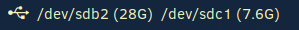

# Script: rofi-usb-mount

A small script that shows your mounted removable devices in a polybar bar. This is an alternate version of [system-usb-mount](https://github.com/polybar/polybar-scripts/tree/master/polybar-scripts/system-usb-mount) that uses rofi in dmenu mode to ask for user input, instead of mounting all removable devices at the same time.
It also uses some ideas taken from [Luke Smith's i3 commands](https://github.com/LukeSmithxyz/voidrice), as I originally only wanted keybinds to mount devices (you can do that too!).

Click left to mount a USB device with a rofi prompt. Click right to unmount a device. Click middle (the scrolling wheel) to unmount _all_ available devices. Using this option, the removable devices are then turned off with `udisksctl power-off`. Every time an operation is made, a desktop notification is sent using `notify-send`.

It also shows a small icon when USB devices are available but have not been mounted yet.




## Dependencies

* `rofi`
* `udisks2`

## Configuration

It _should_ work out of the box. However, feel free to change the rofi options to whatever style you want. Additionally, you can change the `#` in lines 6 and 9 to your preferred symbol to indicate USB drives.

## Module

```ini
[module/rofi-usb-mount]
type = custom/script
exec = ~/polybar-scripts/rofi-usb-mount.sh --check
tail = true
click-left = ~/polybar-scripts/rofi-usb-mount.sh --mount
click-right = ~/polybar-scripts/rofi-usb-mount.sh --umount
click-middle = ~/polybar-scripts/rofi-usb-mount.sh --umount-all
```
